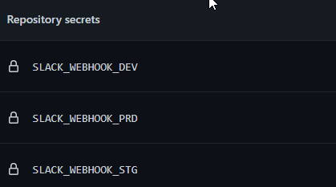

# How to send notification into slack

## If you want to send notifications to slack channel

- Add SLACK_WEBHOOK_ENV secret to repository. [Webhook generation](https://slack.com/apps/A0F7XDUAZ-incoming-webhooks)



- Add into with block
```
send_notification_to_slack: true
```
- Add into secrets block previously added secret (inherit mode does not allowed)
```
SLACK_WEBHOOK: ${{ secrets.SLACK_WEBHOOK_DEV }}
```
### Example:
```
...
with:
  send_notification_to_slack: true
...
secrets:
  SLACK_WEBHOOK: ${{ secrets.SLACK_WEBHOOK_DEV }}
```
- reusable-workflows version >= 1.1.0